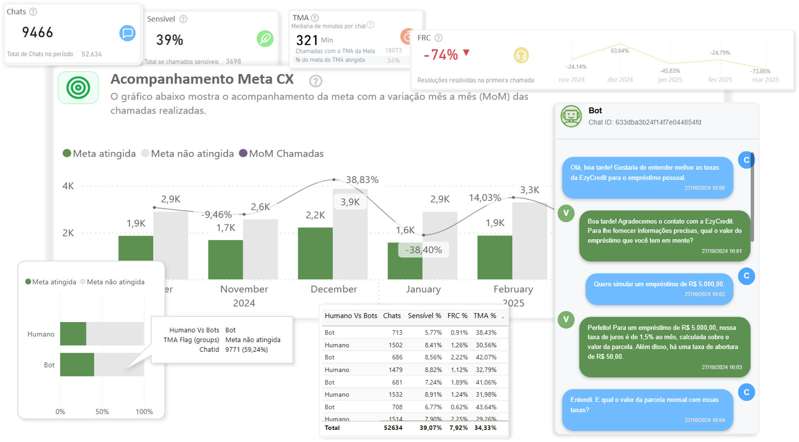

# 📊 EzyCredit - Dashboard de Análise de Atendimento (CX)

  

### Este projeto consiste em um painel interativo desenvolvido para uma empresa fictícia chamada **EzyCredit** de emprestimos financeiros, com foco na **análise do desempenho do atendimento ao cliente (CX)**. A proposta foi criar uma solução de BI que permita avaliar, acompanhar e melhorar a qualidade do atendimento prestado por agentes humanos e bots.

<a href="https://app.powerbi.com/view?r=eyJrIjoiZmM5M2NmN2UtMzFiNy00YWRhLTkzN2MtM2VmMGYzMzU2NDM0IiwidCI6ImQ2NGQ5ZTY3LTQxZjItNDAyOS1hY2M3LTE2MDYxNTcxNjYwYiJ9" target="_blank" style="text-decoration: none;">
  <button style="padding: 10px 20px; font-size: 16px; background-color: #368574ff; color: white; border: none; border-radius: 5px; cursor: pointer;">
    Acesse o Dashboard
  </button>
</a>

## 🚀 Objetivo

O objetivo deste Dashboard é transformar dados de atendimento em **insights estratégicos e operacionais** que ajudem o time de CX a:

Contexto

- Monitorar o volume de chats por período;
- Avaliar o desempenho por agente;
- Comparar interações humanas e bots;
- Detectar conversas sensíveis;
- Identificar problemas de resolução na primeira chamada;
- Controlar a meta de tempo médio de atendimento.

---
## 🛠️ Tecnologias Utilizadas

  

- **Power BI** – Para criação e publicação do dashboard interativo.
- **Python** – Para simulação de dados, tratamento e estruturação dos datasets.
- **Ollama** – Modelo de linguagem **gemma3** local utilizado para geração automatizada de conversas sintéticas, simulando atendimentos reais com segurança de dados.
- **HTML e CSS** – Utilizados na criação de **visuais personalizados**, permitindo maior flexibilidade estética e funcional, como dashboards web customizados ou visuais avançados fora dos componentes nativos do Power BI.

---

## 🧠 Regras de Negócio & KPI's

Para análise de performance, foram criadas métricas personalizadas, incluindo:

<strong>• Chats (Total de conversas )</strong> – Total de conversas por e total de mensagens trocadas no período.

  

<strong>• TMA (Tempo Médio de Atendimento)</strong> – Mediana do tempo por chat.

  

<strong>• FRC (First Resolution Contact)</strong> – Métrica de resolução na primeira interação.

  

<strong>• Sensibilidade</strong> – Classificação de conversas com temas sensíveis (ex: cobranças, jurídico, fraudes).

  

<strong>• Acompanhamento Meta CX</strong> – Acompanhamento da meta de agentes que estão resolvendo os casos, por chat Id

  

<strong>• Acompanhamento Meta CX</strong> – Acompanhamento da meta de agentes que resolveu caso e também a relação entre humanos e chatbots que solucionaram o problema

  

---

> ⚠️ Nenhum dado sensível ou real foi utilizado neste projeto. As conversas foram geradas artificialmente via LLMs.

---

## 📁 Estrutura do Projeto
